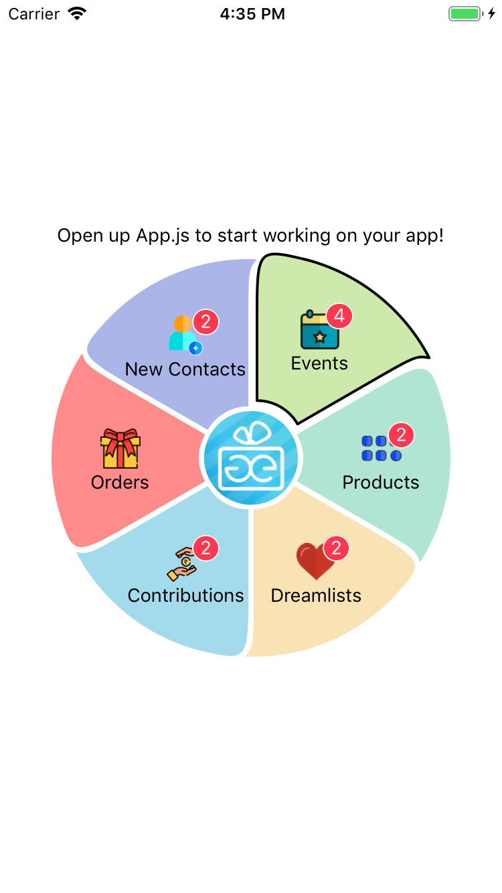

## Components

### Interactive Pie Chart

```javascript
import InteractivePie from "@webileapps/react-native-piechart"
```
* Respects styles
* Supports [customization](App.js) of slice colors and views 

### Badge
A red round rect view with a `count`
Look in App.js
### Icon Badge
Look in App.js

### Badge


## No Shadows!
React native does not support shadows as of now.

## End Result
